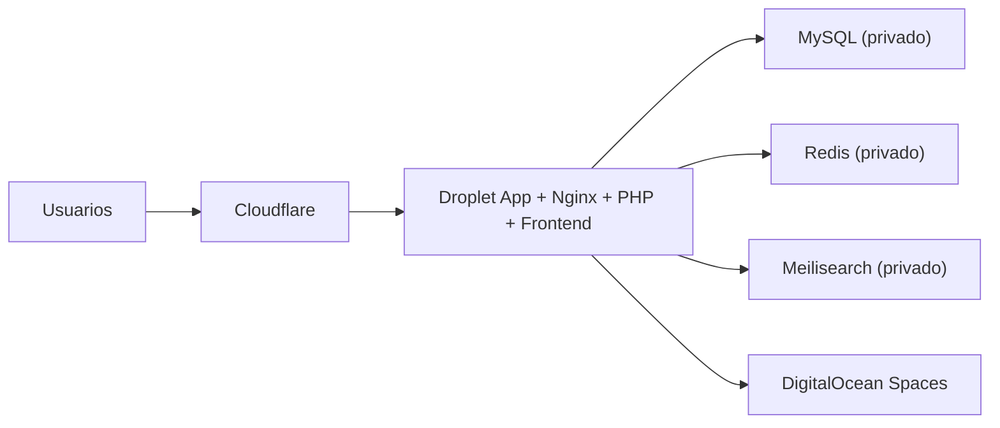

# Despliegue Seguro

## Objetivo

Este documento resume una forma segura y razonablemente simple de desplegar StackBase en un Droplet de DigitalOcean, con Cloudflare al frente, sin convertir la base en una infraestructura innecesariamente compleja para 2026-2027.

La idea es mantener cuatro principios:

- simple de operar
- suficientemente segura para una empresa mediana
- clara para desarrolladores y soporte
- barata de arrancar y facil de endurecer despues

## Resumen ejecutivo

La recomendacion base es esta:

1. Cloudflare delante del dominio publico
2. un Droplet de aplicacion con Docker Compose de produccion
3. base de datos, Redis y Meilisearch sin exposicion publica
4. Cloud Firewall de DigitalOcean para cerrar la superficie de red
5. TLS estricto, secretos fuera del repo y despliegue automatizado por GitHub Actions

Si se quiere una respuesta corta:

- para una primera etapa seria, Cloudflare `Pro` + un Droplet bien configurado + Spaces + firewall de DigitalOcean es una base buena
- no hace falta arrancar con una arquitectura enorme
- pero si hace falta ser estricto con red, cookies seguras, secretos, backups y acceso SSH

## Estado actual del proyecto

Con los cambios de hardening ya aplicados, la base mejoro en cuatro puntos importantes:

- la sesion web ya no depende de `localStorage`; el flujo web usa cookie `HttpOnly`
- los webhooks entrantes ahora validan firma, timestamp y proteccion anti-replay
- el login tiene rate limiting mas estricto
- la configuracion de sesion y cookies ya tiene soporte explicito para endurecimiento por entorno

Eso mejora bastante la posicion frente a una auditoria basica, pero el despliegue sigue siendo clave. Un proyecto puede tener buen codigo y quedar expuesto por una mala red o malos secretos.

## Topologia recomendada

### Opcion recomendada para empezar

- `Cloudflare` como proxy del dominio publico
- `Droplet` unico para app/web/worker/scheduler
- `MySQL`, `Redis` y `Meilisearch` en la misma red Docker privada del host
- `Spaces` para archivos
- `GitHub Actions` para deploy

Visualmente:

Esta opcion sirve muy bien para una primera etapa si:

- el trafico no es enorme
- no necesitas alta disponibilidad inmediata
- priorizas orden y seguridad sobre complejidad prematura

### Opcion siguiente cuando crezca

- Cloudflare al frente
- 1 Droplet solo para edge/app/web
- 1 Droplet solo para workers pesados
- base de datos gestionada o MySQL separado
- Redis separado si el volumen de colas crece

No hace falta arrancar ahi.

## Recomendacion de red segura

### 1. Cloudflare

Usar Cloudflare como punto de entrada publico.

Config minima recomendada:

- DNS proxied para el dominio de la app
- `SSL/TLS = Full (strict)`
- `Always Use HTTPS`
- `Automatic HTTPS Rewrites`
- `WAF managed rules` si usas plan Pro o superior
- `Rate limiting` para login, rutas admin sensibles y webhooks
- cache solo para recursos publicos y estaticos
- `no cache` para `/api/*`

### 2. Firewall de DigitalOcean

Usar Cloud Firewall de DigitalOcean para cerrar puertos.

Regla minima:

- permitir `80` y `443` desde Internet
- permitir `22` solo desde IPs de administracion conocidas, VPN o una red Zero Trust
- no exponer `3306`, `6379`, `7700` ni otros puertos internos

DigitalOcean documenta que sus Cloud Firewalls se ofrecen `sin costo adicional`:

- [DigitalOcean Firewalls Quickstart](https://docs.digitalocean.com/products/networking/firewalls/getting-started/quickstart/)

### 3. Firewall del host

Ademas del Cloud Firewall, usar firewall del sistema operativo en el Droplet:

- `ufw` o nftables
- misma politica: solo `22`, `80`, `443`
- denegar todo lo demas

### 4. Servicios internos no publicos

Nunca publicar directamente:

- MySQL
- Redis
- Meilisearch
- workers
- scheduler

Todo eso debe quedar accesible solo dentro del host o red privada.

## SSH y acceso administrativo

Lo mas seguro es:

- acceso por clave SSH, no password
- usuario no root para operacion normal
- `sudo` solo donde haga falta
- desactivar login por password
- desactivar login SSH directo de root
- usar `fail2ban` si expones `22`

### Recomendacion practica

Si quieres GitHub Actions desplegando directo por SSH y a la vez limitar `22`, hay una tension real:

- GitHub-hosted runners no tienen un rango fijo facil de operar para allowlist estricta
- por seguridad, lo mejor es uno de estos caminos:
  - usar un runner self-hosted dentro de tu red
  - usar Tailscale o WireGuard para acceso administrativo
  - usar Cloudflare Tunnel o Access para administracion web y dejar SSH por VPN

Si no haces eso y dejas `22` abierto al mundo, debes asumir mas riesgo.

## Cloudflare: como usarlo bien

### Lo que si conviene

- CDN y DNS delante del sitio
- TLS gestionado
- WAF en Pro
- rate limiting para `/api/v1/auth/login`
- reglas especificas para `/api/v1/webhooks/incoming/*`
- bloqueo geografico si el negocio opera solo en ciertos paises

### Lo que no conviene

- cachear respuestas API autenticadas
- dejar rutas administrativas con cache agresiva
- mezclar cache publica y respuestas por usuario
- pensar que Cloudflare reemplaza permisos internos o validaciones del backend

## Variables sensibles y configuracion recomendada

### Backend

En produccion, como minimo:

- `APP_ENV=production`
- `APP_DEBUG=false`
- `APP_URL=https://tu-dominio`
- `FRONTEND_URL=https://tu-dominio`
- `CORS_ALLOWED_ORIGINS=https://tu-dominio`
- `SESSION_SECURE_COOKIE=true`
- `SESSION_SAME_SITE=strict`
- `AUTH_COOKIE_SECURE=true`
- `AUTH_COOKIE_SAME_SITE=strict`
- `AUTH_COOKIE_DOMAIN=tu-dominio`
- `WEBHOOK_REPLAY_WINDOW_SECONDS=300`
- `WEBHOOK_REQUIRE_TIMESTAMP=true`

Si usas subdominios, ajustar `AUTH_COOKIE_DOMAIN` segun el dominio real.

### Archivos

Mantener `Spaces` privado para los archivos funcionales y descargar a traves del backend o URLs firmadas.

No usar bucket publico para:

- adjuntos privados
- exportaciones pesadas
- archivos internos

## Base de datos, Redis y Meilisearch

### Base de datos

Para primera etapa:

- puede ir en el mismo Droplet
- pero solo privada y con backups activables

Si el sistema se vuelve critico:

- migrar a DB gestionada o a un host separado

### Redis

Debe ser privado.

Nunca:

- publico en `0.0.0.0`
- sin password si por alguna razon sale de localhost

### Meilisearch

Debe quedar privado.

No exponerlo a internet aunque tenga master key.

## Seguridad de aplicacion en Cloudflare

### Rate limiting sugerido

- `POST /api/v1/auth/login`
  - muy restrictivo
- `POST /api/v1/webhooks/incoming/*`
  - moderado, segun el proveedor
- `POST /api/v1/auth/api-tokens`
  - bajo
- `POST /api/v1/users/*/reset-password`
  - bajo

### WAF

Cloudflare documenta que el plan Pro incluye reglas administradas y OWASP, muy utiles para una base corporativa:

- [Cloudflare Pro](https://www.cloudflare.com/es-es/plans/pro/)

## Costos orientativos

Estos valores pueden cambiar. Toma esto como orientacion y verifica siempre antes en los enlaces oficiales.

### Cloudflare

Segun la pagina oficial del plan Pro, Cloudflare Pro figura en `USD 25/mes` o `USD 240/anual`:

- [Cloudflare Pro](https://www.cloudflare.com/es-es/plans/pro/)

En la pagina general de planes tambien aparecen add-ons utiles:

- Load Balancing: `desde USD 5/mes`
- Smart Shield + Argo: `desde USD 5/mes`
- Access: `desde USD 3/mes`

Fuente:

- [Cloudflare Plans](https://www.cloudflare.com/plans/)

### DigitalOcean

DigitalOcean documenta:

- Droplets: cobro por segundo y precio segun plan
- ancho de banda extra: `USD 0.01 por GiB`
- DNS: `gratis`
- backups de Basic Droplets:
  - semanal: `+20%` del costo mensual del Droplet
  - diario: `+30%` del costo mensual del Droplet

Fuentes:

- [Droplet Pricing](https://docs.digitalocean.com/products/droplets/details/pricing/)
- [DNS Pricing](https://docs.digitalocean.com/products/networking/dns/details/pricing/)
- [Backups Pricing](https://docs.digitalocean.com/products/backups/details/pricing/)

Para Spaces y Load Balancers, revisa:

- [Spaces](https://docs.digitalocean.com/products/spaces/)
- [Load Balancers](https://docs.digitalocean.com/products/networking/load-balancers/)

### Lectura rapida de costo base

Una base razonable de arranque suele verse asi:

- `Droplet` de aplicacion: variable segun tamanio
- `Cloudflare Pro`: `USD 25/mes`
- `Spaces`: normalmente uno de los primeros costos fijos importantes
- `Cloud Firewall`: sin costo adicional
- `DNS`: gratis

En otras palabras:

- si vas por una arquitectura simple, el costo fijo de seguridad/perimetro no es enorme
- el gran variable es el tamano del Droplet y si activas add-ons o backups

## Arquitecturas recomendadas por etapa

### Etapa 1: pequena o mediana

- 1 Droplet
- Cloudflare Pro
- Spaces
- firewall bien cerrado

Ventaja:

- barata
- simple
- suficientemente segura si operas con disciplina

### Etapa 2: mas critica

- 2 Droplets
- DB separada o gestionada
- Redis separado si sube la cola
- observabilidad externa
- backups automáticos

## Checklist minimo antes de abrir a usuarios

- `APP_DEBUG=false`
- deploy productivo con `docker-compose.prod.yml`
- cookies seguras activas
- `CORS_ALLOWED_ORIGINS` solo con dominios reales
- solo `80/443` expuestos
- `22` restringido o protegido por VPN/Zero Trust
- DB/Redis/Meilisearch sin exposicion publica
- Cloudflare en `Full (strict)`
- WAF o al menos rate limiting en login
- secretos solo en `.env` del servidor y GitHub Secrets
- healthcheck funcionando
- logs revisables

## Recomendacion final

Para esta base, yo no recomiendo sobrearquitectura desde el dia uno.

La combinacion mas sensata es:

- Cloudflare Pro
- un Droplet bien endurecido
- Docker Compose de produccion
- Spaces
- firewall estricto
- deploy por GitHub Actions con secretos bien gestionados

Eso da una base clara, segura y mantenible sin convertir StackBase en un Frankenstein operativo.
